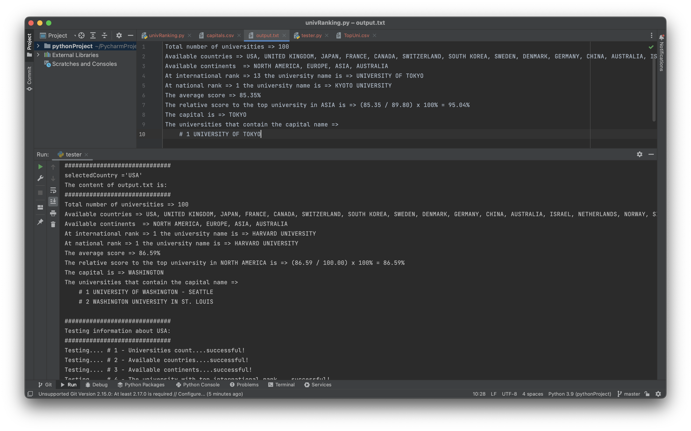

# UniversityRanking
This program reads and analyzes the content of two CSV, one that contains the top 100 universities and one that contains details about some countries. It displays information extracted from these files and prints them onto a txt file. 

# Demo

# Technical Stack
Python
